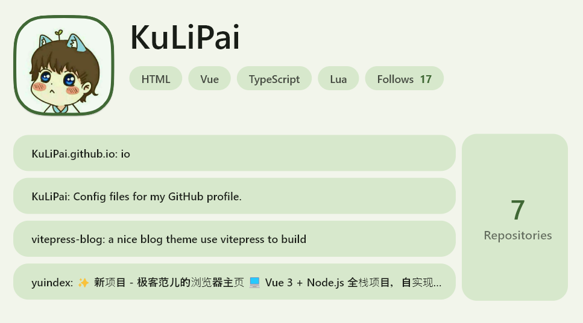
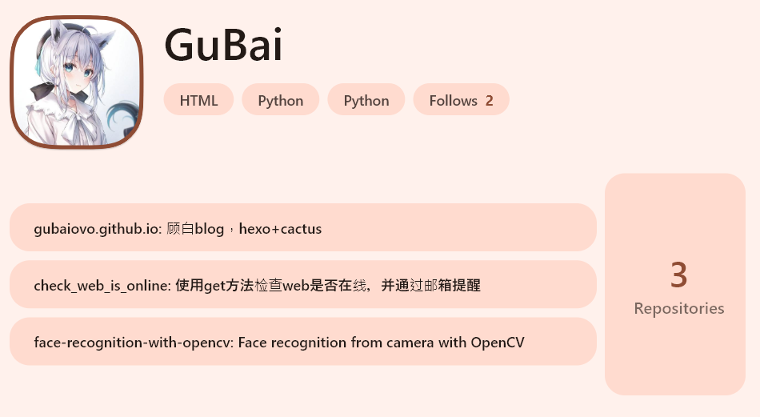

# README_zh

# GithubCard

一个 Flutter 应用，用于生成 GitHub 主页卡片。

## 🌟 特性

* **支持 Windows（全屏）和 Web（全屏）**
* **自动爬取** GitHub 主页信息
* **美观的卡片展示**

## 🖼️ 示例

一图胜千言：

​​

​​

​​

## ⚠️ 已知问题

* **Web 端 CORS 问题**：用户需要手动解决跨域请求问题。
* **部分主页爬取可能失败**。

## 🛠️ 安装与运行

1. **克隆项目**

    ```sh
    git clone https://github.com/yourusername/GithubCard.git
    cd GithubCard
    ```
2. **安装依赖**

    ```sh
    flutter pub get
    ```
3. **运行应用**

    * **Windows 端**

      ```sh
      flutter run -d windows
      ```
    * **Web 端**

      ```sh
      flutter run -d chrome
      ```

      （请确保已正确设置 CORS）

## 📜 许可证

[MIT License](https://chatgpt.com/c/LICENSE)
